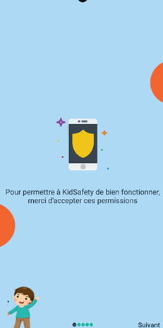
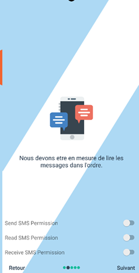
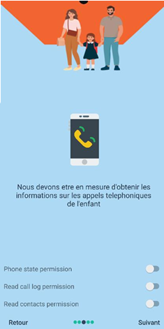
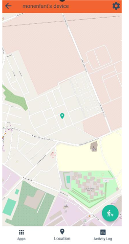
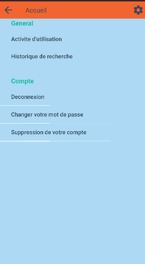

# 👨‍👩‍👧 Kidsafety – Application de Contrôle Parental

📱 *Projet de fin d'études (PFE)* réalisé à l’Université Sidi Mohamed Ben Abdellah – Fès  
🗓️ Soutenu le 24 mai 2024  
👩‍💻 Par : Abibatou NDIAYE  
🎓 Filière : Sciences Mathématiques et Informatique (SMI)

---

## 🌟 Présentation du projet

**Kidsafety** est une application Android de contrôle parental conçue pour permettre aux parents de :
- surveiller les activités de leurs enfants sur mobile,
- localiser leur position en temps réel,
- bloquer certaines applications ou sites,
- visualiser les messages, appels et contacts,
- définir des zones sécurisées (geofencing).

Ce projet a été développé en Java avec Android Studio, en utilisant **Firebase** pour l’authentification, la base de données temps réel, le stockage, et la messagerie cloud.

---

## 🛠 Fonctionnalités principales

- 🔐 Authentification parent / enfant via Firebase
- 📍 Géolocalisation en temps réel avec alertes
- 🕒 Gestion du temps d’écran
- 🚫 Blocage d’applications
- ✉️ Surveillance des SMS / Appels / Contacts
- 📊 Tableau de bord parent complet

---

## 🧪 Aperçu de l'application

📸 **Captures d’écran**  

- Page de connexion parent/enfant  
- Interface enfant (permissions)  
- Dashboard parent avec historique des activités  
- Géolocalisation et zones sécurisées

---

---

## 🔧 Technologies utilisées

| Outil / Techno     | Usage                         |
|--------------------|-------------------------------|
| Java               | Développement Android         |
| XML                | Interfaces graphiques          |
| Firebase           | Auth, DB, Storage, FCM         |
| Android Studio     | IDE principal                 |
| UML (EA Sparx)     | Conception (UML)              |
| Canva              | Design visuel                 |

---

## 🔐 Sécurité & confidentialité

L’application respecte les bonnes pratiques de sécurité :
- Vérification de compte par email
- Permissions explicites (Android ≥ 6)
- Aucune donnée sensible stockée localement

---

## 📚 Rapport complet

📄 Le rapport détaillé du projet est disponible ici :  
[📥 Rapport Final – PDF](./Rapport_VFinal.pdf)

---

## 🚫 Accès au code source

Par souci de confidentialité, le code source complet n'est pas publié ici.  
Seules des **captures d’écran, extraits** ou **vidéos de démonstration** sont fournis.

---

## 🎥 Démo vidéo

📺 https://drive.google.com/file/d/1_nWW0645gAp0Gaa-DFHbOPI_37XwZ24k/view?usp=drivesdk*  

---
---

## 🖥 Présentation de soutenance

🎓 Ce diaporama a été présenté lors de ma soutenance de projet de fin d'études à l'Université Sidi Mohamed Ben Abdellah (Fès) en 2024.

📊 [Voir la présentation Canva](https://www.canva.com/design/DAGGB6xmZws/x1sjdmZPm0v7W9HvLr0VTg/view?utm_content=DAGGB6xmZws&utm_campaign=designshare&utm_medium=link&utm_source=edito)

---

## 🖼️ Captures d’écran

### 1. Sélection du type d'utilisateur

### 2. Inscription des utilisateurs
**Inscription Enfant**  

**Inscription Parent**  

### 3. Connexion

### 4. Vérification du compte

### 5. Permissions demandées
  
  

### 6. Accueil parent

### 7. Accueil enfant

---

## 📍 Fonction de géolocalisation

- Localisation de l’enfant en temps réel  

- Définition d’un périmètre GeoFence  

---

## 📊 Contrôle parental

- Liste des apps utilisées par l’enfant  

- Suivi des communications (SMS, appels, contacts)  
  

---

## ⚙️ Paramètres

---

## 📩 Contact

Pour toute question ou démonstration privée :  
👉 [Me contacter via LinkedIn ou GitHub](https://github.com/abiibatouu)

---

